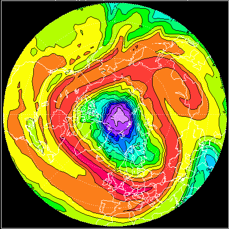

# REPROBUS

REPROBUS (Reactive Processes Ruling the Ozone Budget in the Stratosphere) is a 3D chemistry-transport model calculating the temporal evolution of 55 chemical species via 147 chemical reactions (Lefèvre et al, 1998). Heterogeneous reactions are also taken into account. Liquid PSCs (Polar Stratospheric Clouds) are described using the model of Carslaw et al (1995). Wind and temperature fields from ECMWF analyses data are imposed every 3 hours. The time step of the chemical calculations is 15 minutes.

<p align="center">
    
</p>

## Requirements
The REPROBUS tool is containerized into a Singularity container so one must have Singularity installed on the host system intended for simulations.

## Installation
```
git clone https://github.com/aeris-data/reprobus.git
sudo singularity build ./reprobus-image.sif ./reprobus-ifort-container.def
```

The `singularity build` command will build the container `reprobus-image.sif` from its definition file, using the source files got from the git repo; so for the build it is important to call the command from the git repo directory that one has made. 

⚠️ ***The build requires either sudo rights or being able to use `--fakeroot` option (in a case of a multi-user server).*** 

Afterwards, the sif image can be placed anywhere (even on another system) independently of the source files. To run the image no sudo rights are required.

## Usage
The main script is `reprobus-simulation.sh` which needs the input configuration file `reprobus-user.conf` (which can be renamed, the name is not important). This bash script handles user's input parameters, launch simulations and post-process simulation results. The main usage is 
```
$ ./reprobus-simulation.sh --config reprobus-user.conf
```

⚠️ ***The script must be launched inside the Singularity container.***

The outputs of the simulation are : simulation results for the 40 observation stations, the daily REPROBUS recovery files (also needed for the ulterior simulations) and the PNG files of the results visualisation . More details about input/output and folder structure are in the manual `xxx.pdf`.

There are two possible ways to launch the simulation inside the Singularity container:
- one-line command (run a command within a container, wait for the end of simulation to regain control of the shell)
```
$ singularity exec [--bind path1,path2] reprobus-image.sif ./reprobus-simulation.sh --config reprobus-user.conf
```
- interactive mode (run a shell within a container, then launch the command within the shell of the container)
```
$ singularity shell [--bind path1,path2] reprobus-image.sif
Singularity>
Singularity> ./reprobus-simulation.sh --config reprobus-user.conf
```

### Bind option

The `--bind` option allows to map directories on the host system to directories within the container. Most of the time, this option allows to solve the error *"File (or directory) not found"*, when all of the paths are configured correctly but the error persists. Here is why it can happen. When Singularity ‘swaps’ the host operating system for the one inside your container, the host file systems becomes partially inaccessible. The system administrator has the ability to define what bind paths will be included automatically inside each container. Some bind paths are automatically derived (e.g. a user’s home directory) and some are statically defined (e.g. bind paths in the Singularity configuration file). In the default configuration, the directories $HOME , /tmp , /proc , /sys , /dev, and $PWD are among the system-defined bind paths. Thus, in order to read and/or write files on the host system from within the container, one must to bind the necessary directories if they are not automatically included. Here’s an example of using the `--bind` option and binding `/data` on the host to `/mnt` in the container (`/mnt` does not need to already exist in the container):

```
$ ls /data
bar  foo

$ singularity exec --bind /data:/mnt my_container.sif ls /mnt
bar  foo
```

You can bind multiple directories in a single command with this syntax:

```
$ singularity shell --bind /opt,/data:/mnt my_container.sif
```

This will bind `/opt` on the host to `/opt` in the container and `/data` on the host to `/mnt` in the container.

## Input meteorological data extraction
The input data for the simulations is meteorological data : wind, temperature, humidity and logarithm of surface pressure, coming from the ECMWF database. To extract and prepare the data in the correct format, the script `reprobus-extract-ecmwf.sh` should be used:
```
./reprobus-extract-ecmwf.sh --config ./ecmwf.conf
```
This script handles the data extraction and its formatting for the REPROBUS tool. The user can configure the start and end date of the data, as well as the spatial resolution. The script must be launched on the ECMWF MARS server (ecs, hpc or other). The data extraction was tested with a member-state user account. Other more public accounts might customize the script based on the MARS services or APIs available for their type of user. The data is extracted and stored in the directory requested in the input configuration; afterwards, the data can be used for the simulation. The transfer of the data to the host where the simulation will be executed is to be done by the user.
